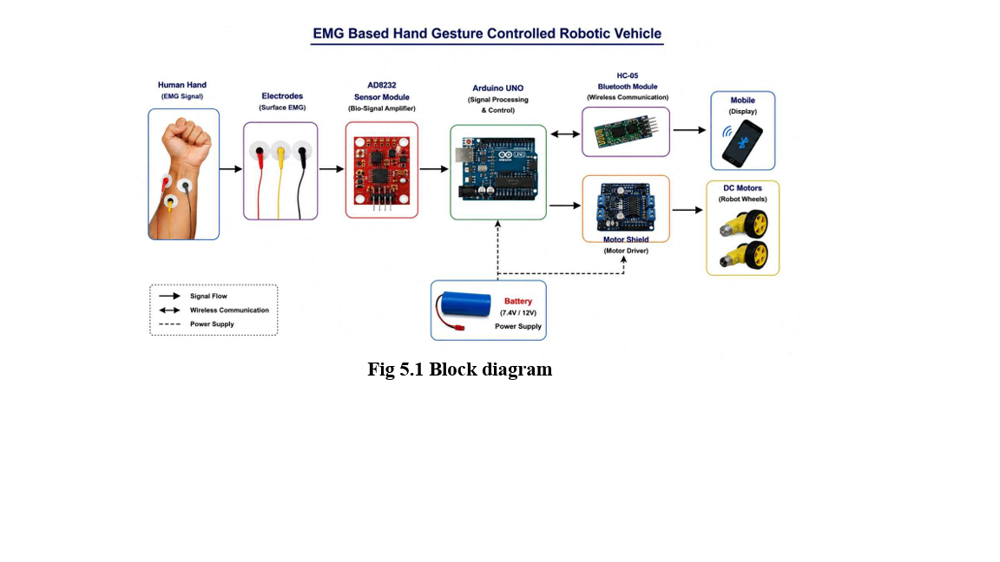
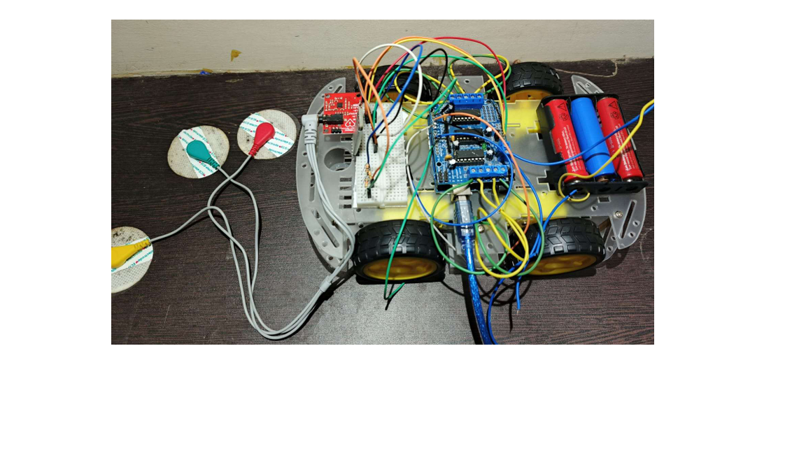

# EMG Gesture-Controlled Assistive Mobility Robot

An Arduino-based proof-of-concept assistive mobility robot that uses a bio-signal captured from forearm electrodes to control a robotic vehicle.

## Problem

People with severe mobility limitations may find conventional joystick controls difficult to use. This project explores a low-cost hands-free control method using muscle-contraction signals.

## How It Works

Electrodes placed on the hand or forearm capture a bio-signal. The AD8232 module amplifies and filters the signal. Arduino reads the signal and compares it with a threshold value.

- Hand contraction above the threshold: robot moves forward
- Relaxed hand: robot stops
- HC-05 Bluetooth sends sensor values and movement status to a mobile device

## Hardware Used

- Arduino Uno
- AD8232 bio-signal sensor module
- Electrodes
- Motor driver shield
- Four DC motors and robotic chassis
- HC-05 Bluetooth module
- Battery, breadboard, and jumper wires

## Software Used

- Arduino IDE
- Embedded C/C++
- AFMotor library
- SoftwareSerial library

## Current Features

- Reads analog bio-signal values from Arduino pin A0
- Uses threshold-based movement control
- Moves the robotic prototype forward
- Stops the robot when the signal is below the threshold
- Sends VALUE, FORWARD, and STOP status messages through Bluetooth

## Future Improvements

- Add left, right, and reverse movement gestures
- Calibrate the threshold for each user
- Add better noise filtering
- Add obstacle detection and emergency stop
- Develop a mobile monitoring application

## Note

This is an academic proof-of-concept robotic vehicle, not a medical-grade wheelchair.

## Project Images

### Block Diagram

### Hardware Prototype

